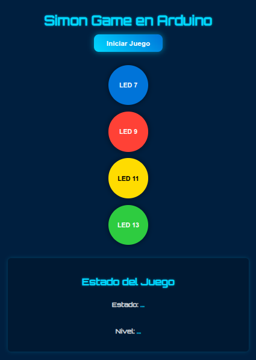

# Trabajo Práctico Integrador - Sistemas Embebidos

***Licenciatura en Ciencias de la Computación, Facultad de Ingeniería, UNCuyo***

Integrantes:
- Masuelli, Luciano
- Silva, Yeumen
- Yornet de Rosas, Agustín

## Objetivo del Proyecto
Desarrollar una versión del clásico juego Simón, utilizando un Arduino UNO para el control físico del juego mediante LEDs, e integrarlo con una interfaz web desarrollada con Flask (Python), HTML, CSS y JavaScript para la interacción del usuario.

## Funcionalidad del Juego

El Arduino genera una secuencia aleatoria de luces (simulando colores). Dicha se muestra al usuario mediante los LEDs.

El usuario debe replicar la secuencia desde una página web que muestra los botones correspondientes. Cada botón en la web está vinculado a un color (LED) del Arduino.

Si el usuario acierta, la secuencia se alarga; si falla, se reinicia.

## Integración Web - Arduino

Arduino actúa como servidor del juego: gestiona la lógica de secuencias y controla los LEDs.

Se usa comunicación serial entre el Arduino y el backend hecho en Flask.

El frontend (HTML/CSS/JS) envía los leds presionados por jugador mediante JSONs al backend Flask.

Flask traduce los datos del usuario y los envía al Arduino por serial para validar las secuencias de luces.

Arduino envía el estado del juego y los leds que se encienden o se esperan prender.

## Tecnologías Empleadas

- Arduino IDE y C++ para la lógica del juego y manejo de LEDs.

- Flask para el servidor web que comunica el navegador con el Arduino.

- HTML/CSS para la interfaz visual con botones interactivos.

- JavaScript para el manejo de eventos de los botones y comunicación con Flask.

## Visualización

