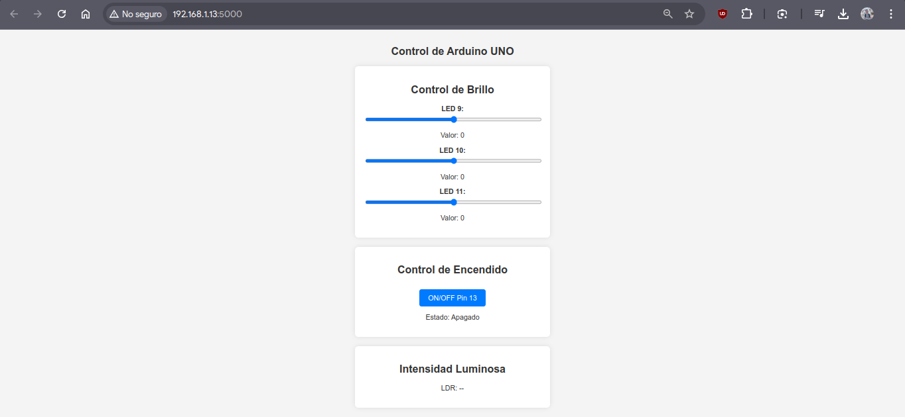

# Trabajo Práctico Nº1 - Sistemas Embebidos

***Licenciatura en Ciencias de la Computación, Facultad de Ingeniería, UNCuyo***

Integrantes:
- Masuelli, Luciano
- Silva, Yeumen
- Yornet de Rosas, Agustín


## Actividad 1
> **Enunciado 1.** Controle el brillo de los led 9, 10 y 11 del Arduino UNO utilizando el conversor Digital a Analógico del mismo. El brillo de estos leds debe controlarse de forma independiente para cada led.

Para este ejercicio, se empleó el código que se encuentra en `src/main.cpp`. La siguiente porción de código es la encargada de configurar los pines y recibir entradas por medio del monitor serial para prender los LEDs según corresponda.

```cpp
int leds[] = {9, 10, 11};  // Pines donde están conectados los LEDs
int brillos[] = {0, 0, 0}; // Brillo inicial de los LEDs
...

void setup()
{
  Serial.begin(9600);
  for (int i = 0; i < 3; i++)
  {
    pinMode(leds[i], OUTPUT);
  }
  ...
}

// Función que convierte el número del pin en su índice correspondiente
int getLedIndex(int pin)
{
  for (int i = 0; i < 3; i++)
  {
    if (leds[i] == pin)
    {
      return i; // Devuelve el índice si encuentra el pin
    }
  }
  return -1; // Retorna -1 si el pin no es válido
}

void loop()
{
  if (Serial.available())
  {
    String data = Serial.readStringUntil('\n');
    int pin, brillo;
    char estado[4];

    Serial.print("Data: ");
    Serial.println(data);

    // Intentar extraer los valores esperados (Ejemplo de entrada: "9,128")
    if (sscanf(data.c_str(), "%d,%d", &pin, &brillo) == 2)
    {
      int ledIndex = getLedIndex(pin); // Convertir pin en índice

      if (ledIndex != -1 && brillo >= 0 && brillo <= 255)
      {
        brillos[ledIndex] = brillo;
        analogWrite(leds[ledIndex], brillo);
        Serial.print("LED en pin ");
        Serial.print(pin);
        Serial.print(" -> Brillo: ");
        Serial.println(brillo);
      }
      else
      {
        Serial.println("Error: Valores fuera de rango.");
      }
    }
    else if ...
}
```

---

> **Enunciado 2.** Encienda y apague el led 13 del Arduino UNO. Deberá utilizar dicho pin como salida digital.

```cpp

const int led13 = 13;      // Pin del led en la placa


void setup()
{
  ...
  pinMode(led13, OUTPUT);
  ...
}

...

void loop()
{
  if (Serial.available())
  {
    ...
    if (sscanf(data.c_str(), "%d,%d", &pin, &brillo) == 2)
    {
      ...
    }
    else if (sscanf(data.c_str(), "%d,%3s", &pin, estado) == 2 && pin == 13)
    {
      if (strcmp(estado, "ON") == 0)
      {
        digitalWrite(led13, HIGH);
        Serial.println("LED 13 encendido.");
      }
      else if (strcmp(estado, "OFF") == 0)
      {
        digitalWrite(led13, LOW);
        Serial.println("LED 13 apagado.");
      }
      else
      {
        Serial.println("Error: Usa '13,ON' o '13,OFF' para controlar el LED 13.");
      }
    }
    else
    {
      Serial.println("Error: Formato incorrecto. Usa 'LED,BRILLO' o '13,ON/OFF'.");
    }
  }
  ...
}
```
---
> **Ejercicio 3.** Muestre la intensidad luminosa captada por el LDR (conectado al pin A3 del
Arduino UNO). Deberá utilizar el conversor Analógico a Digital.

```cpp
const int ldrPin = A3;     // Pin analógico donde está conectado el LDR

void setup()
{
  ...
  pinMode(ldrPin,INPUT);
}

...

void loop()
{
  ...
  // Leer la intensidad luminosa del LDR
  int ldrValue = analogRead(ldrPin);
  Serial.print("Intensidad luminosa (LDR): ");
  Serial.println(ldrValue);
  
  delay(1000); // Leer cada segundo
}
```
---
> **Ejercicio 4 & 5.** El control del brillo de los led 9, 10 y 11, el pin 13 y el valor de la intensidad luminosa sensado por el LDR deberá realizarse y mostrarse a través de una página web que deberá poder accederse desde otras computadoras conectadas en la misma red LAN o Internet. La página web debe mostrar el valor actual del brillo de los leds, el estado del pin 13 y el valor leído por el LDR.

La página web fue realizada con Flask para el BackEnd, y HTML, CSS y JavaScript para el FrontEnd.

- `app.py`: BackEnd de la página web.
- `static/js/script.js`: Script encargado de la comunicación entre la vista web y el BackEnd.
- `static/css/styles.css`: Hoja de estilos para la página.
- `templates/index.html`: Estructura de la página.

Vista previa:


