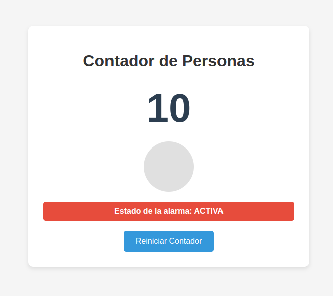

# Trabajo Práctico Nº4 - Sistemas Embebidos

***Licenciatura en Ciencias de la Computación, Facultad de Ingeniería, UNCuyo***

Integrantes:
- Masuelli, Luciano
- Silva, Yeumen
- Yornet de Rosas, Agustín

## Resolución

Para llevar a cabo este trabajo, inicialmente se desarrolló la lógica para utilizar el sensor ultrasónico desde el Arduino. Teniendo como componentes principales: 

**1. Configuración Inicial (setup)**  
Configura los pines del sensor ultrasónico y los LEDs.
Inicializa variables y estructuras para el filtro de lecturas.  
Carga el contador de personas desde la memoria EEPROM.
Realiza un test de los LEDs y notifica que el sistema está listo.  

**2. Bucle Principal (loop)**  
- Lectura del sensor: Llama a `readAndFilterDistance` para obtener la distancia filtrada.  
- Detección de presencia:  
    - Si la distancia es menor al umbral (`DETECTION_THRESHOLD_CM`), detecta si alguien está presente y maneja estados como:
        - Confirmación de presencia tras un tiempo mínimo.
        - Activación de alarma si la persona está detenida demasiado tiempo.  
    - Si la distancia es mayor al umbral con histéresis, detecta que la persona ha salido y actualiza el contador.  
- Tareas periódicas: Actualiza el estado de la alarma, maneja comandos seriales y guarda el contador en EEPROM si es necesario.  

**3. Funciones Principales**  
- `readAndFilterDistance`: Lee la distancia del sensor ultrasónico, aplica filtros (rango, picos y promedio móvil) para obtener una lectura estable.
- `updateAlarmState`: Controla el parpadeo de los LEDs y notifica el estado de la alarma.
- `setAllLeds`: Enciende o apaga todos los LEDs.
- `loadCountFromEEPROM`: Carga el contador de personas desde la EEPROM, verificando un valor mágico para asegurar integridad.
- `saveCountToEEPROMIfNeeded`: Guarda el contador en EEPROM si ha cambiado, evitando desgaste innecesario.
- `handleSerialCommands`: Procesa comandos recibidos por el puerto serial, como resetear el contador o consultar el estado.  

También se desarrolló en Flask una aplicación que actúa como una interfaz entre un Arduino y un cliente web. Se conecta al Arduino a través de un puerto serial, lee datos como el conteo de personas y el estado de la alarma, y los expone mediante una API REST. También permite enviar comandos al Arduino, como reiniciar el contador. Utiliza un hilo separado para manejar la comunicación serial y actualiza el estado en tiempo real. 

La interfaz gráfica muestra un contador de personas detectadas y un indicador que se prende cuando ocurre una detección, también se informa el estado de la alarma y cuenta con un botón para reiniciar el contador.

