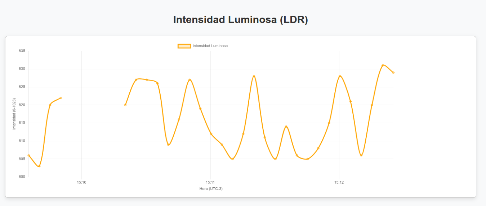

# Trabajo Práctico Nº5 - Sistemas Embebidos

***Licenciatura en Ciencias de la Computación, Facultad de Ingeniería, UNCuyo***

Integrantes:
- Masuelli, Luciano
- Silva, Yeumen
- Yornet de Rosas, Agustín

## Resolución
Para este Trabajo Práctico, se desarrolló una aplicación que obtiene lecturas de intensidad luminosa utilizando el sensor LDR del Arduino UNO y realiza un gráfico que se muestra sobre una página web. El gráfico muestra los últimos 30 datos obtenidos del Arduino UNO. El eje vertical representa la intensidad luminosa y  el eje horizontal representa la hora UTC-3 (hora de Argentina). El gráfico fue hecho utilizando la herramienta Canvas de JavaScript.

La página web, además, cumple ciertas restricciones:

1. Las lecturas se producen cada 5 segundos.
2. Si hay intervalos de tiempo sin lecturas (por pérdida de energía eléctrica por ejemplo), la gráfica muestra una discontinuidad.
3. El gráfico no muestra todas las etiquetas de tiempo en el eje horizontal para facilitar la lectura. Únicamente muestra las marcas de tiempos por minutos.

 